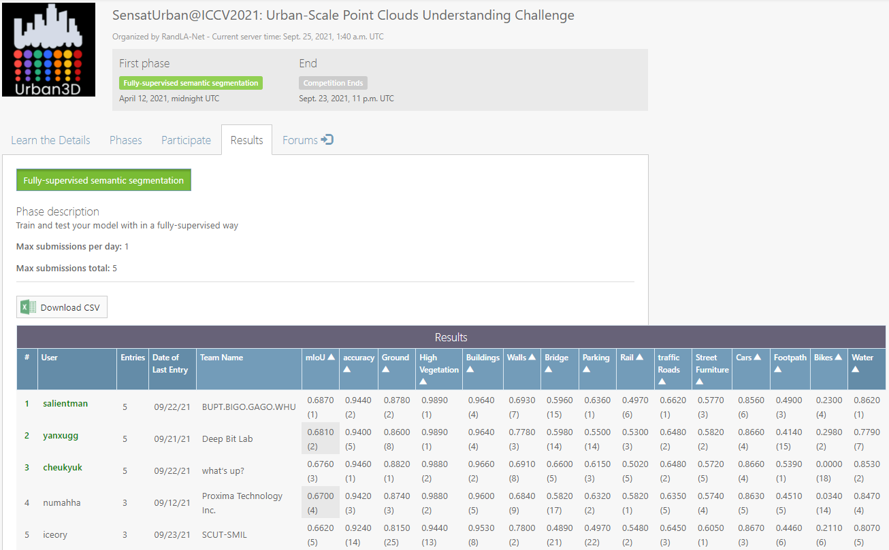

# SensatUrban 2nd Solution
This repository is for the **runner up** solution for the ICCV 2021 workshop challenge [SensatUrban](https://competitions.codalab.org/competitions/31519#participate-submit_results). 



## Getting Started

### Requirements
- `Ubuntu 16.04`
- `Anaconda` with `python=3.7`
- `tensorFlow=1.14`
- `cuda=10.1`
- `cudnn=7.6.5`
- others: `pip install termcolor opencv-python toposort h5py easydict`

### Compile custom operators
```bash
sh init.sh
```

## Data preparation
(1) Download the files named "data_release.zip" [here](https://forms.gle/m4HJiqZxnq8rmjc8A). Uncompress it.


(2) Preparing the dataset
```
python prepare_data.py --dataset_path $YOURPATH
cd $YOURPATH; 
cd ../; mkdir original_block_ply; mv data_release/train/* original_block_ply; mv data_release/test/* original_block_ply;
mv data_release/grid* ./
```
(3) The data should organized in the following format:
```
/Dataset/SensatUrban/
          └── original_block_ply/
                  ├── birmingham_block_0.ply
                  ├── birmingham_block_1.ply 
		  ...
	    	  └── cambridge_block_34.ply 
          └── grid_0.200/
	     	  ├── birmingham_block_0_KDTree.pkl
                  ├── birmingham_block_0.ply
		  ├── birmingham_block_0_proj.pkl 
		  ...
	    	  └── cambridge_block_34.ply 
```


### Training
We train our model with two V100 GPUs. If you want to use other type of GPU with smaller batch size or other model architecture, you can modify the configuration in `cfgs/sensaturban/baseline_version1.yaml`.
```shell
python function/train_evaluate_sensaturban.py --cfg cfgs/sensaturban/baseline_version1.yaml  --gpus 0 1
```
* The results will be saved in `./log/`.
* You can use `--trainval` to train on both trianing and validation sets.

### Evaluation
```shell
python function/evaluate_sensaturban.py  --load_path [YOUR_MODEL_PATH]  --cfg cfgs/sensaturban/baseline_version1.yaml
```
* The results will be saved in `./log_eval/`.

### Submit to benchmark
```shell
python function/test_sensaturban.py  --load_path [YOUR_MODEL_PATH]  --cfg cfgs/sensaturban/baseline_version1.yaml
```
* The results will be saved in `./log_test/`.
* Submit the results to the [evaluation server](https://competitions.codalab.org/competitions/31519#participate-submit_results). 

### Pre-trained model
We currently release a checkpoints with about 66% mIoU in `./log/default_checkpoints/`, and more powerful checkpoints will be released in the future.
| Input | mIoU | Accuracy | Checkpoints
|--|--|--|--|
| xyz+rgb |  65.8  | 94.0 |  `./log/default_checkpoints/`

You can specific the checkpoint in evaluation or testing by using
```shell
--load_path ./log/default_checkpoints/model.ckpt-600 
```

## Citation
If you find our work useful in your research, please consider citing:
```latex
@inproceedings{yan2021sensaturbansol,
  title={SensatUrban 2st Solution},
  author={Xu Yan},
  booktitle={https://github.com/yanx27/SensatUrban_sol_tf},
  year={2021}
}
```

## Acknowledgement
This project is not possible without multiple great opensourced codebases.

* [SensatUrban](https://github.com/QingyongHu/SensatUrban)
* [CloserLook3D](https://github.com/zeliu98/CloserLook3D)